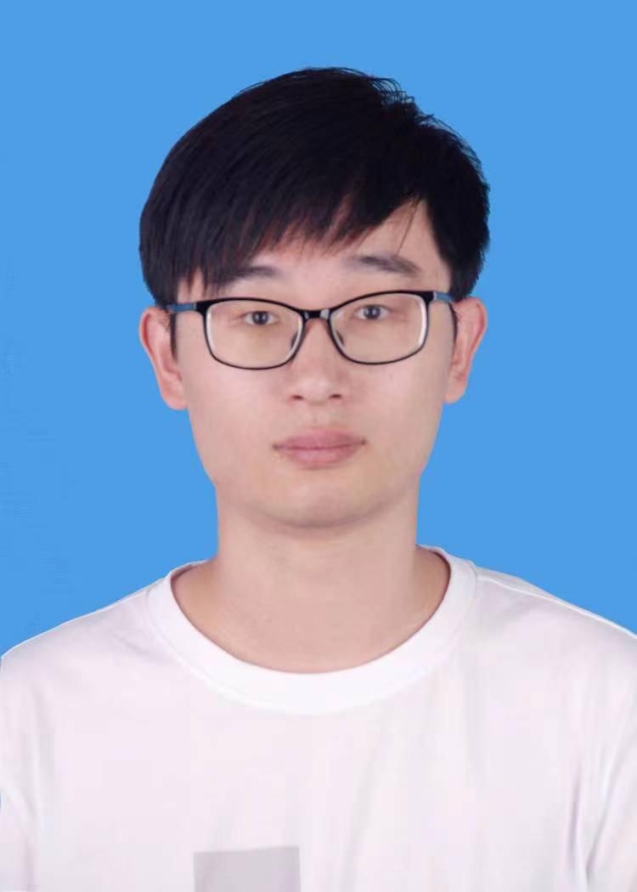

    <h1>陈佳恩</h1>
    

        
            
            17757899370
        
        ·
        
            
            jiaenchen2024@outlook.com
        
        ·
        
            
            <a href="https://github.com/jiaenchen2024">jiaenchen2024</a>
        
        ·
        <!-- 
            
            <a href="#">My Blog</a>
         -->
    

 ##  个人信息 
 
 - 2022级电子信息
 - 石河子大学信息科学与技术学院模式识别与机器学习实验室

##  研究方向

- **遥感图像智能解译**

主要研究遥感图像的语义分割和变化检测方法。

##  学术动态

[1] Jiaen Chen, Shengjie Xu, Yuchen Zheng*. BaAFN: A Boundary-aware Attention Fusion Network for Remote Sensing Semantic Segmentation [J]. IEEE Transactions on Geoscience and Remote Sensing. (SCI Q1/一区, IF:7.5) (Under Review)
[2] Jiaen Chen, Shengjie Xu, Da Wu, Quanqing Ma, Yuchen Zheng*. AGFormer: An Anchor-Guided Transformer for Class Imbalance in Remote Sensing Change Detection [J]. Pattern Recognition. (SCI Q1/一区, IF: 7.5) (Under Review)
[3] Jiaen Chen, Da Wu, Quanqing Ma, Zhe Zhao, Yuanfeng Wu, Yuanyuan Ren, Yuchen Zheng*. Adapting CNN-Transfomer Based Foundation Models for Remote Sensing Change Detection [J]. IEEE Transactions on Geoscience and Remote Sensing. (SCI Q1/一区, IF:7.5) (Under Review)

##  荣誉奖项

中国移动梧桐杯大数据创新大赛二等奖。

