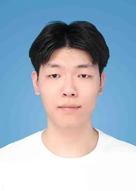

    <h1>刘子昂</h1>
    

        
            
            13699823811
        
        ·
        
            
            13699823811@139.com
        
    

 ##  个人信息 
 
 - 2025级电子信息
 - 石河子大学信息科学与技术学院模式识别与机器学习实验室

##  研究方向

- **多语种自动语音识别翻译**
研究端到端的多语种语音翻译，涵盖ASR，MT，TTS等技术，挖掘源语言与目标语言之间的转换特征，构建出具备高度适应性的多语种ASR翻译系统。
关键词：深度学习、自动语音识别、多语种翻译

##  学术动态

##  荣誉奖项

