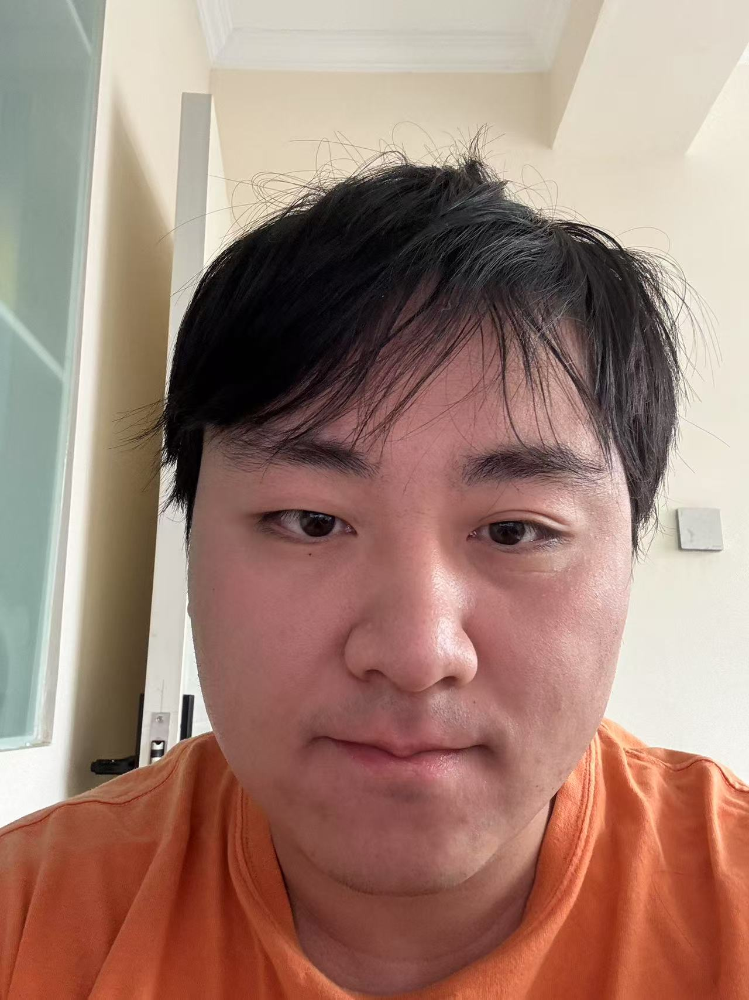

    <h1>杨意飞</h1>
    

        
            
            15325348316
        
        ·
        
            
            yyxxyyzero@163.com
        
    

 ##  个人信息 
 
 - 2024级电子信息
 - 石河子大学信息科学与技术学院模式识别与机器学习实验室

##  研究方向

- **图神经网络及其应用**
图神经网络在分子性质预测领域展现出了强大的潜力，因为分子结构天然适合用图表示。通过图神经网络对分子结构进行建模，挖掘分子深层性质，对分子性质进行预测。
关键词：机器学习、模式识别、图神经网络

##  学术动态

