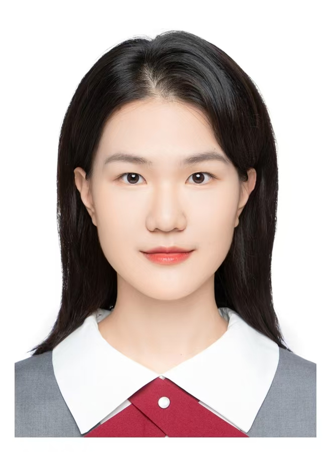

    <h1>张齐悦</h1>
    

        
            
            17699937682
        
        ·
        
            
            1401191427@qq.com
        
    

 ##  个人信息 
 
 - 2024级图书情报
 - 石河子大学信息科学与技术学院模式识别与机器学习实验室

##  研究方向

- **LLM的文献知识挖掘与推荐**
通过结合自然语言处理、文本表示学习及图神经网络等技术，从文献中提取隐含的研究主题、知识关联与前沿趋势。在此基础上，设计个性化推荐算法，依据用户的研究兴趣、历史行为，精准匹配高价值文献，优化科研资源发现效率。
关键词：LLM、自然语言处理、文献推荐

##  学术动态

##  荣誉奖项

