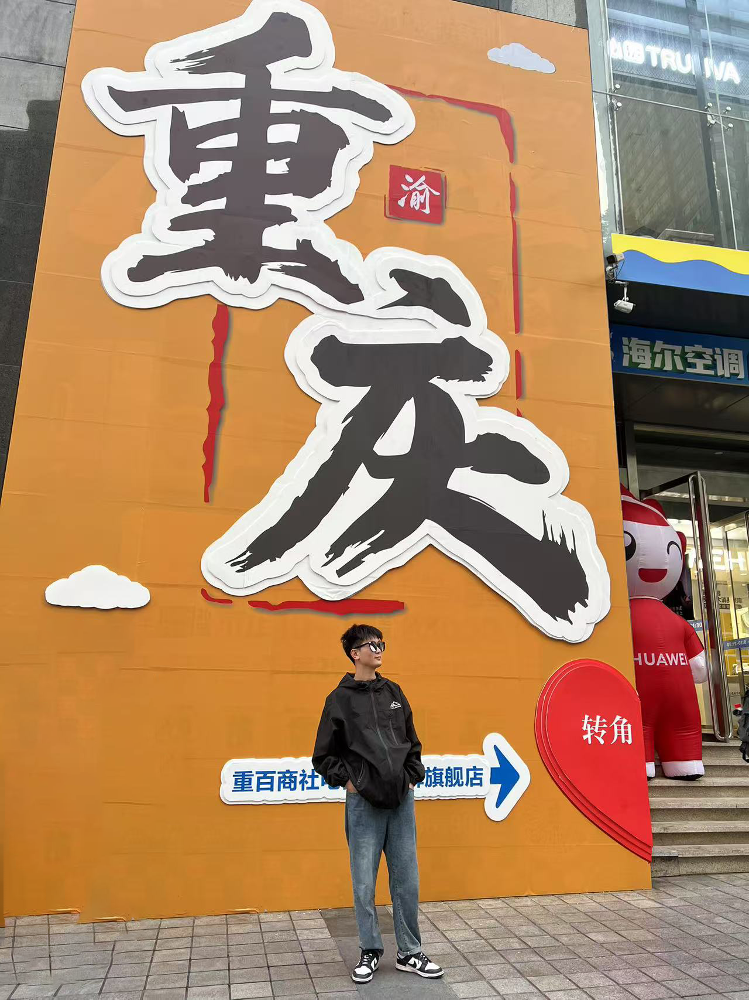

    <h1>郑礼东</h1>
    

        
            
            -------------
        
        ·
        
            
            zld0608@outlook.com
        
        ·
        
            
            <a href="https://github.com/copycpp">My Git</a>
        
        ·
        
            
            <a href="https://orcid.org/0009-0003-3150-2986">My ORCID</a>
        
    

 ##  个人信息 
 
 - 石河子大学信息科学与技术学院2022级电子信息硕士研究生、模式识别与机器学习实验室
 - 南京航空航天大学计算机科学与技术学院2025届博士研究生（拟录取）

##  研究方向

- **模式识别、针对离线手写签名的特征学习**
针对离线手写签名中真实签名和熟练伪造签名之间微区别特征难以捕获的问题，设计了基于典型关联分析孪生网络的离线手写签名特征学习方法和混合Transformer和卷积神经网络的特征提取网络。
- **联邦学习、针对医学影像的攻击与防御**
针对服务端聚合客户端模型攻击等问题研究有效的防御方法和难以防御的攻击方式。
- **强化学习、图神经网络**
针对联邦学习客户端训练过程解决灾难性遗忘等核心问题。

##  荣誉奖项
- 研究生国家奖学金
- 蓝桥杯新疆省赛二等奖
- 第十二届计算机设计大赛安徽省赛二等奖
- 第八届发现杯软件设计设计大赛华东赛区二等奖
- 第十三届计算机设计大赛安徽省赛三等奖
- 2024石河子大学优秀共产党员
- 2020年本科生国家励志奖学金
- 2018年本科生国家励志奖学金

##  学术动态
- 2024年视觉与学习青年学者研讨会（VALSE）、重庆（参会）
- 2024 13th International Conference on Computing and Pattern Recognition, Tianjin, China. (Oral Presentation)
- <b>L. Zheng</b>, D. Wu, S. Xu, Y. Zheng. HTCSigNet: A Hybrid Transformer and Convolution Signature Network for Offline Signature Verification[J]. Pattern Recognition, 2025: 111146. （JCR Q1, 中科院Q1, CCF-B, IF:7.5）
- <b>L. Zheng</b>, X. Zhao, S. Xu, Y. Ren, Y. Zheng. Learning Discriminative Representations by a Canonical Correlation Analysis-based Siamese Network for Offline Signature Verification[J]. Engineering Applications of Artificial Intelligence, 2025: 109640. （JCR Q1, 中科院Q2, CCF-C, IF:7.5）
- <b>L. Zheng</b>, D. Wu, M. Zhang, Y. Zheng. SLFRM: A Novel Signature Local Feature Reconstruction Module for Offline Signature Verification[C]. International Conference on Computing and Pattern Recognition, 2024.（EI）
- X. Zhao, <b>L. Zheng</b>, P. Yuan, Y. Zheng. Fusing Deep and Hand-crafted Features by Deep Canonically Correlated Contractive Autoencoder for Offline Signature Verification[J]. （Pattern Recognition, Major Revision）