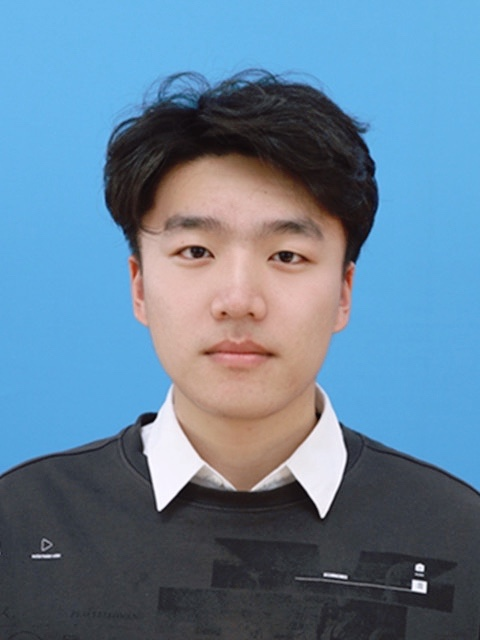

    <h1>徐绍俊</h1>
    

        
            
            17860758138
        
        ·
        
            
            xsj_sc@163.com
        
        ·

 ##  个人信息 
 
 - 2023级图书情报
 - 石河子大学信息科学与技术学院模式识别与机器学习实验室

##  研究方向

- **基于视觉感知特征的纹理图像检索**
针对利用心理物理学实验来获取视觉感知评分较难的问题，采用机器学习技术来模拟人类的打分行为，通过学习人类对纹理图像中蕴含的视觉感知特征的评分，进而自动地对这些特征进行评分，以此构建纹理视觉感知特征库，进而利用查询图像与数据库中图像特征向量的欧氏距离大小来衡量图像相似性，从而实现快速准确的检索。
关键词：心理物理学实验、视觉感知特征、机器学习、纹理检索

##  学术动态

##  荣誉奖项

